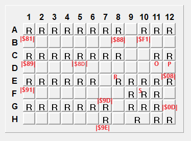

# KeybTrans
Nastavení klávesnic Translog
 
 
(Data klávesnice jsou ve složce Original)
 
Ve složce Original je firmware kterým se aktualizovalo před úpravou!
 
 
Nová úprava provedena dne 26.10.2023
 
V nové verzi, můžeme ji nazvat verzí 1.1, jsou upraveny klávesy F1-F3 (posunuty o řádek nahoru) a přidány nové klávesy.
 
Náhled kódů zde:
 

 
Nová verze je ve složce [NEW!](https://github.com/Fractvival/KeybTrans/tree/main/NEW!)
 
 
Žádná klávesa není opakovací a všechny se nachází ve vrstvě L1 a jazyk US
 
Každá klávesa komunikuje pomocí RS232 (takže NE PS/2) a jde ji zpětně vyčíst v terminálu přímo v ChangeMe
 

